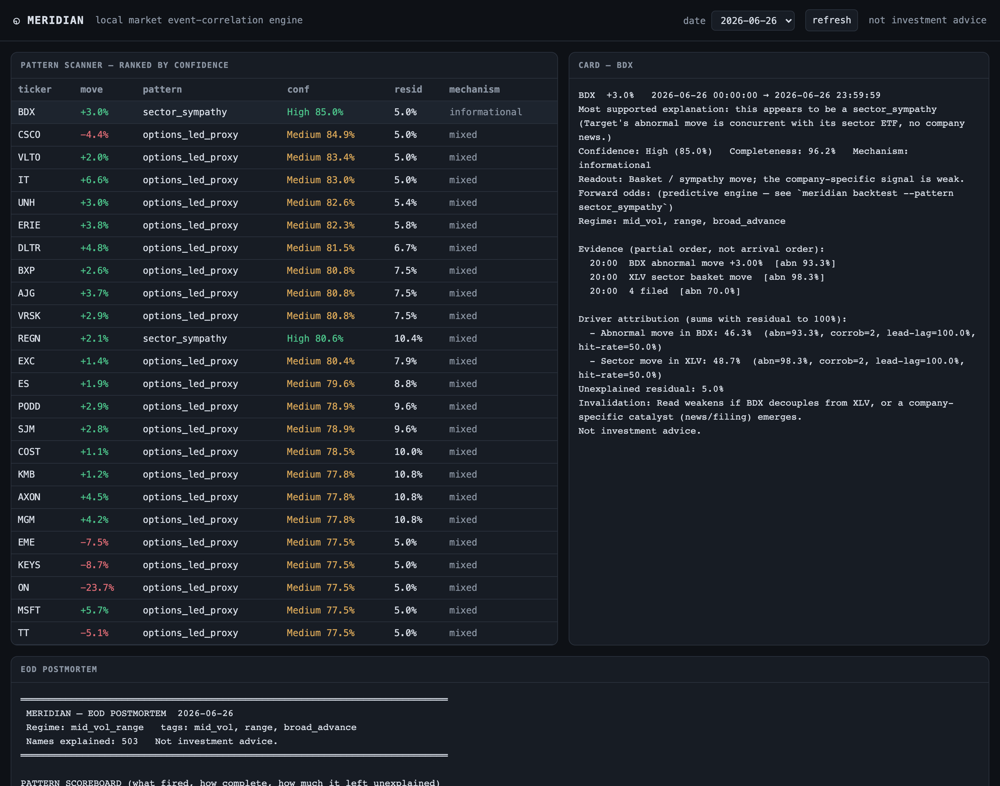

# Meridian

Local market event-correlation + **prediction** engine for stocks. An honest, local,
daily engine that ingests market-event drivers, correlates them in a graded partial-order
("poset") graph, separates the *initiating* event from confirmation/noise, attributes the
move with an auditable evidence trail, scores calibrated forward odds — and always reports
the share of the move it **cannot** explain. Built phase by phase per `ROADMAP.md`.

**Explanation layer is deterministic Jinja templates only — no LLM anywhere.** Not
investment advice.



*The local dashboard (`meridian serve`): ranked scanner, a "why is it moving" card with
the partial-order evidence timeline, driver attribution that sums with the unexplained
residual to 100%, an invalidation line, and the EOD postmortem — all rendered from the
structured evidence object, no LLM.*

## Quickstart
```bash
python -m venv .venv && source .venv/bin/activate
pip install -e ".[data,ml,api,dev]"   # data feeds + ML + dashboard + tests
meridian init                          # create data/meridian.duckdb, schema, universe
meridian status
pytest -q
```

## Daily pipeline (one trading day)
```bash
D=2026-06-26
meridian ingest    --date $D -a yfinance -a fred -a edgar -a news_rss   # Phase 1: typed events
meridian featurize --date $D                                            # Phase 2: L1 grading + state + regime
meridian match     --date $D                                           # Phase 3: poset patterns + audited edges
python scripts/gen_option_fixtures.py $D NVDA MSFT JPM                  # Phase 5: option-chain snapshot (proxy)
meridian options   --date $D                                           # Phase 5: GEX surface + dealer-positioning
meridian featurize --date $D                                           # re-grade incl. dealer_pos
meridian match --patterns gamma_squeeze --date $D                      # Phase 5: the differentiator
meridian postmortem --date $D                                          # Phase 4: scanner + EOD postmortem (residual + invalidation)
meridian card --ticker JPM --date $D --pattern gamma_squeeze          # one "why is it moving" card
```
Or run the whole EOD batch: `meridian run-day --date $D`.

## Predictive engine (Phase 6)
```bash
meridian backfill  --start 2026-05-18 --end 2026-05-29 -a yfinance     # accumulate firing history
meridian label     --start 2026-05-18 --end 2026-05-29                 # forward returns + MFE/MAE
meridian backtest  --pattern gamma_squeeze                            # win-rate + forward odds + decay + residual
meridian calibrate --horizon +1d                                     # walk-forward reliability curves
meridian causal-test --date 2026-05-29                               # Granger-gate edges -> trusted `precedes`
```

## Automation + dashboard (Phase 7/8)
```bash
meridian serve                       # http://127.0.0.1:8765/  (cards, scanner, postmortem)
meridian schedule --mode both        # pre-market + intraday loop + post-close (America/New_York)
meridian install-daily               # write launchd agent (macOS) / cron lines; --activate to load
```

## Architecture (per ROADMAP §3, §14)
```
adapters/  free-first feeds (yfinance, FRED, EDGAR, RSS, earnings, options) → typed events (dual timestamps)
ingest/    normalization + clock alignment + no-lookahead audit
state/     rolling ticker/sector/liquidity state, regimes, expected-behavior (beta+macro) baseline
engine/    L1 featurize (all thresholds) · L2 structural poset match · L3 scoring+attribution · constraints · causal gate · mechanical-vs-informational
options/   local Black-Scholes greeks + GEX proxy + dealer-positioning events
predict/   forward labeling · regime-conditioned odds · walk-forward calibration · honest paper backtest
outputs/   deterministic Jinja cards / scanner / postmortem (single source of truth = the evidence object)
api/       FastAPI + single-page dashboard      schedule/  APScheduler jobs + install
```

## Non-negotiable rules (enforced in code + tests)
- Every event carries `event_time` AND `ingest_time`; correlation uses event-time, never arrival order.
- Pattern matches return graded completeness in [0,1], never booleans.
- Every output reports an unexplained residual AND an invalidation line; attribution + residual = 1.0 (residual never zero).
- A causal `precedes` edge is written only if a lead-lag test passes (p < `engine.causal_test_alpha`); else downgraded.
- All thresholds live in Layer-1 featurization — never in pattern definitions.
- Free data first → Robinhood MCP → paid only where ROADMAP flags it.
- Deterministic engine: every layer has pytest golden-file tests + no-lookahead checks.
```
